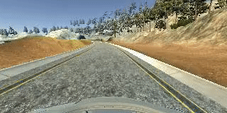

# **Behavioral Cloning Project** 

### In this project, I trained a convolutional neural network (CNN) to learn from simulated driving data and then drive itself around a test track.

---

The goals / steps of this project are the following:
* Use the simulator to collect data of good driving behavior
* Build a CNN in Keras that predicts steering angles from images
* Train and validate the model with a training and validation set
* Test that the model successfully drives around the track one without leaving the road

A visualization of the trained network driving itself around the test track is shown below.

(insert gif)

[//]: # (Image References)

[image0a]: ./imgs/center.jpg "center"
[image0b]: ./imgs/left.jpg "left"
[image0c]: ./imgs/right.jpg "right"
[image1]: ./imgs/log_file.png "drive log"
[image2]: ./imgs/model_plot.png "model summary"
[image3]: ./imgs/loss_track1_bkwd.jpg "loss"
[image4]: ./imgs/steering_angles.jpg "steering angles"

[image5]: ./examples/placeholder_small.png "Recovery Image"
[image6]: ./examples/placeholder_small.png "Normal Image"
[image7]: ./examples/placeholder_small.png "Flipped Image"

### Project Files
My project includes the following files:
* `model.py` containing the script to create and train the model
* `drive.py` for driving the car in autonomous mode
* `model.h5` containing a trained convolution neural network 
* `README.md` summarizing the results 

### Simulation Data
To begin training my model, I used the provided Udacity dataset which consists of camera images of the car driving around the track. There are three cameras mounted left, center, and right of the windshield that simultaneously collect data. 

![alt text][image0a] ![alt text][image0b] ![alt text][image0c]

Having the three cameras helps the network generalize while training. Furthermore, having the left and right images help with correcting the steering angle when the car is off center, as the recorded steering angle corresponds to the center camera image. Therefore, in addition to the center images, I trained the model with the left and right camera images by adding a correction factor that adjusted the steering angle depending on which camera image was used. The log file containing the driving data is shown below (only the steering angle data was used as an output label).

![alt text][image1]

### Model Architecture
My model is a modified version of the CNN proposed by the [comma.ai team](https://github.com/commaai/research/blob/master/train_steering_model.py). The model consists of three convolutional layers followed by a fully connected layer followed by a final output layer. 

The network takes as input a three channel (RGB) color image of height 160 pixels and width 320 pixels. Using the Keras `Cropping2D` function, I remove portions of the image that contain irrelevant data like the sky and the top of the car hood. An added benefit is that cropping also reduces the image size, speeding up training. I use a Keras Lambda layer to normalize the image and center it around zero mean. I used Batch Normalization layers between the convolutional layers to speed up training and reduce the sensitivity to network initialization. The layer architecture is shown below. 

![alt text][image2]

### More Data / Data Augmentation
Training the model with the given dataset and above model parameters for one epoch resulted in the following behavior. Clearly, the model wasn't able to learn with the limited dataset provided and veers off to the side of the road.

I tweaked the model further by collecting more simulation data. I drove backwards around the track in order to combat the left-turn bias present in track one. I also drove off-center and weaved left and right in order to train the network how to respond when it goes off to the side of the road. After loading the pre-trained weights from the previous iteration, I re-trained the model for three epochs with the newly collected data. 

The training and validation losses after this tweaking are shown below. The validation loss ends up being higher than the training loss, implying that the model is overfitting to the training data.

![alt text][image3]

Furthermore, looking at the provided dataset, we can see that most of the steering angle data are zero because there are large portions of the track that are straight. However, this could cause the model to overfit to those straight-line cases and struggle on turns.

![alt text][image4]

To combat this, I augmented the dataset (in addition to the previous augmentation done by using left and right images and adding a correction factor to the steering angles) by flipping the center image horizontally and taking the negative of the steering measurement for any cases where the steering angle was not zero.

### Running the Model
I used the Keras method `fit_generator()` to train the network. The `fit_generator()` function works with datasets that are too large to fit into memory (RAM); it assumes that there is an underlying function that is generating the data for it infinitely. By setting the `steps_per_epoch` to be the total number of training data points divided by the batch size, the `fit_generator()` function will know to move from one epoch to the other once it hits the specified step count. The final output of the trained network is shown in the gif above - the CNN has learned to travel successfully around the track!

### Lessons learned
This was a very rewarding project - after hours of tweaking and frustrating mistakes while coding, seeing the car drive itself around the track made it worth the while. I realized the importance of having enough training data - adding more driving examples and a variety of scenarios helped the model learn to generalize. I combatted overfitting by applying regularization techniques like data augmentation. And I realized how much faster training a deep network on a GPU is than on a CPU. 

### Future Work
While the model is able to drive itself around Track1, it has probably overfitted to that track and wouldn't be able to generalize will to more challenging tracks that have tricky lighty and sharp turns. I could train the network on more examples using different track data in order for the model to generalize to more tracks.
