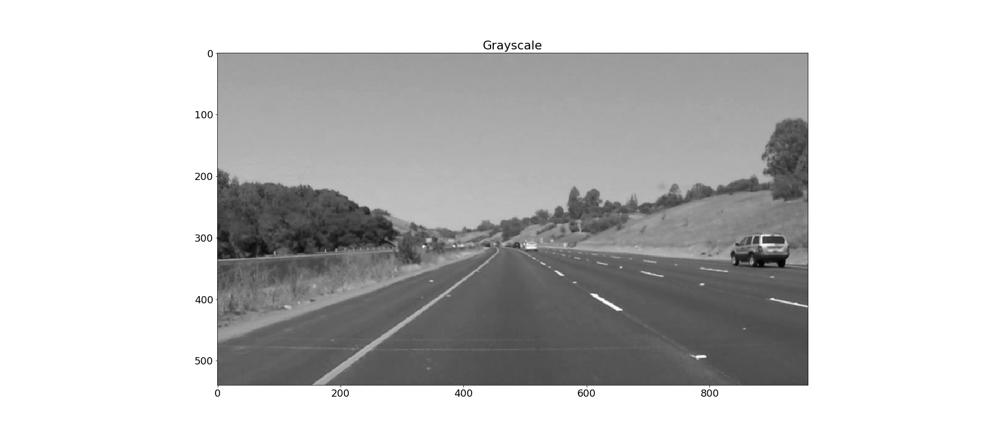
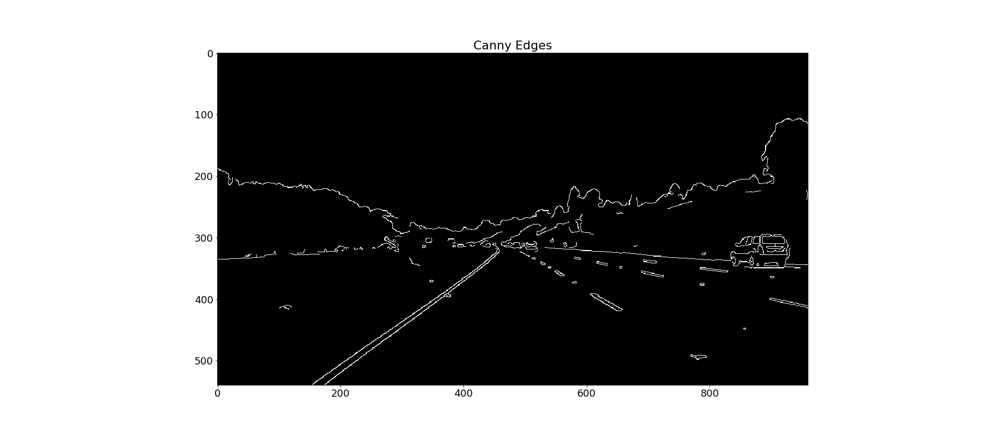
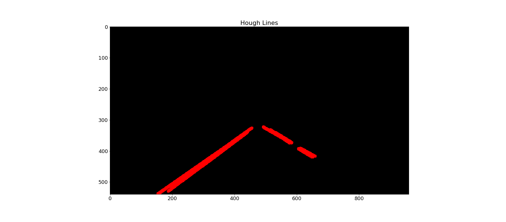
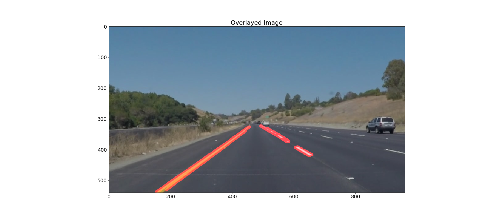
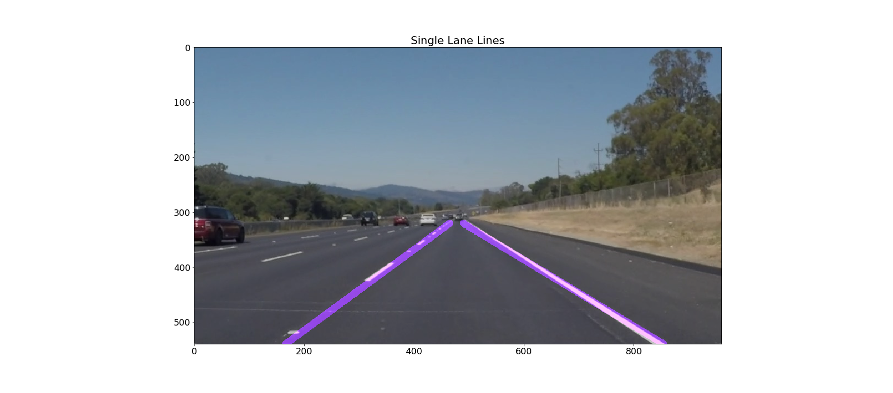

# **Finding Lane Lines on the Road** 

In this first Udacity Self-Driving Car Nanodegree project, I was tasked with finding lane lines on images using computer vision techniques. After finding lanes on images, I extended it to work on video streams. 

## Pipeline

The series of steps I followed to find lane lines is as follows:
1. Convert the image to grayscale
2. Apply a Gaussian blur to the image
3. Detect edges in the image using the Canny algorithm
4. Create a region-of-interest that masks only the portions of the image that contain lane lines
5. Use the Hough transformation to find the line segments based on the edges
6. Extrapolate the disjointed left and right line segments to form cohesive left and right lane markings

The pictures below illustrate the process:
      

## Drawing Lane Lines
The steps for drawing a single, solid line for both left and right lane lines are as follows:
1. Classify the line segments as either left or right by positive or negative slope, respectively
2. Find the average values for slope and intercept (m_avg and b_avg) for the left lane segments
3. Repeat step 2 for the right line segments
4. Compute two points for the left lane segment (x1,y2) and (x2,y2) using the known values for the height of the frame, m_avg and b_avg, and region-of-interest masking points
5. Repeate step 4 for the right lane segment
6. Feed the points into the cv2.line() method to create left and right lane lines      

The final output:     

## Future Work
Although this is a good first pass, the lane detection can be much more robust. As can be seen from the videos, there is jitter in the lane line detection as the drawn lane lines jump between frames. Furthermore, curved roads, unfavorable lighting conditions, and faint/lack of lane lines can all cause the algorithm to struggle. 

