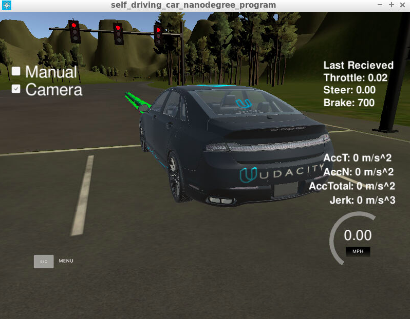

# Capstone Project: Building a self-driving car
In this final project, I built a ROS-enabled system that allows the vehicle to drive around a test track while avoiding obstacles and stopping at traffic lights. The figure below shows the car stopped at a red light before proceeding based on its waypoints around the simulated track.

The project was divided into three distinct parts or subsystems: perception, control, and planning. **Perception** involved building a traffic light detection node and a traffic light classification node. **Planning** involved coding the the waypoint updater, which sets the target velocity for each waypoint based on the upcoming traffic lights and obstacles. **Control** involved the drive-by-wire ROS node that takes target trajectory as input and sends control commands to navigate the vehicle. Combining these three parts into one system ensured that the vehicle was able to effectively navigate around the test track and stop at traffic lights.

## Implementation
I implemented the project in the following steps:

### Traffic light detection
I performed traffic light color detection using OpenCV and Python - I started by defining upper and lower pixel limits for each of the colors Red, Yellow, and Green. Then I applied a mask using OpenCV's `inRange()` method, which returns a mask specifiying with pixels fall into the defined upper and lower pixel ranges. Finally, I use OpenCV's `countNonZero()` method to count the non-zero array elements inside the mask. If there are more red or yellow counts in the image, I classify the traffic as red, signalling the vehicle to stop. Otherwise, if the red pixels do not outnumber the green pixels, the light is classified as green.

Furthermore, using the vehicle's location and the (x, y) coordinates for traffic lights also allows us to find the nearest visible traffic light ahead of the vehicle. This takes place in the `process_traffic_lights` method of `tl_detector.py`. Using these waypoint indices (`get_closest_waypoint()`), I determined which light is ahead of the vehicle along the list of waypoints. 

The core functionality of these steps takes place in the `l_detector.py` method of `tl_classifier.py` files.

### Waypoint Updater Node
The purpose of this node is to publish a fixed number of waypoints ahead of the vehicle with the correct target velocities, depending on traffic lights and obstacles and to slow the vehicle down to a stop if there is a red light detected.

Refer to `./ros/src/waypoint_updater/` for more details.

### Drive-by-Wire (DBW) Node
The DBW node contains the ROS message definitions and acts as the bridge between hardware and software by allowing ROS to actuate the car's steering and throttle. 

Refer to `./ros/src/twist_controller/` for more details.

### Thoughts
I tested the output using Udacity's GPU enabled simulator. However, there were still problems with latency in the simulation with the camera turned on. Running on a separate machine outside of the VM has been said to help with this known problem. 

I learned a lot through this challenging project and how all the pieces fit together in order to make the ROS nodes communicate with each other.

