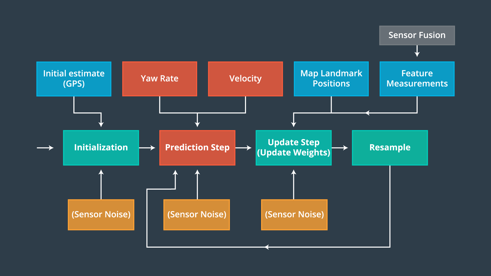

# **Kidnapped Vehicle Project** 

### In this project, I implemented a 2 dimensional particle filter in C++. The particle filter is given a map and some initial localization information (analogous to what a GPS would provide). At each time step the filter also gets observation and control data.

### Overview
The robot has been 'kidnapped' and transported to a new location. Luckily it has a map of this location, a (noisy) GPS estimate of its initial location, and lots of (noisy) sensor and control data. Given this information, our ultimate goal is to use a particle filter and find a weight parameter for each particle that represents how well that particle fits to being in the same location as the actual car.

The gif below demonstrates my implementation. The are landmarks on the map while the lines are the range sensor observations.

<include gif>

The following files are included in the 'src' directory:
` `

### Particle Filters
Unlike the Kalman filter which is a single Gaussian, the particle filter can be used to represent multi-modal distributions. The particle filter uses particles to represent a discrete guess (X and Y coordinates, heading) as to where the robot might be. The set of several thousand of these guesses forms the filter - depending on how consistent the particles are with the sensor measurements, the correct set of particles will survive. Those thousands of particles that are then clustered together at a single location form the approximate belief of the robot as it localizes itself.

The filter has 4 main steps - Initialization, Prediction, Update, and Resample. The figure below illustrates these major steps:

I use a particle filter to accurately localize the vehicle, or locate where the car is in a given map with an accuracy of 10cm or less. A particle filter uses particles (discrete guesses comprised of x and y coordinates, and heading direction) to localize the vehicle - the set of all these particles comprise the posterior location estimate of the vehicle. Depending on how consistent the particles' guesses are with the sensor measurements, the filter causes particles to survive or die. 

The following overview outlines the steps of a particle filter:

 

 

     
